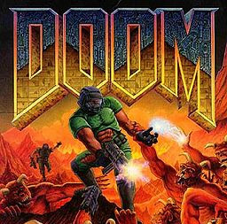

# `jku.wad`
<div align="center">
    <picture>
    
    </picture>
</div>

---

`jku.wad` is the final challenge for the 2025 deep reinforcement learning course at JKU.

The environment is based on the 1993 first person shooter __DOOM__.
It is set up as a deathmatch, and can be played as a single agent against bots, or with multiple agents against each other.
- __Actions:__ `Discrete(6)`, simplified game buttons
- __Observations:__ `192x256` RGB game frames

## Setup
```bash
git clone https://github.com/gerkone/jku.wad
cd jku.wad
pip install -r requirements.txt
```


## Acknowledgements
- [VizDoom](https://github.com/Farama-Foundation/ViZDoom), game interface for RL.
- [Arena](https://github.com/tencent-ailab/Arena), adapted as a multi-agent DOOM environment.